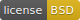

<p align="center"><a href="#readme"></a></p>

<p align="center">
  <a href="https://kaos.sh/g/go-linenoise.v3"></a>
  <a href="https://kaos.sh/y/go-linenoise"></a>
  <a href="https://kaos.sh/w/go-linenoise/ci"></a>
  <a href="https://kaos.sh/w/go-linenoise/codeql"></a>
  <a href="LICENSE"></a>
</p>

<p align="center"><a href="#example">Example</a> • <a href="#ci-status">CI Status</a> • <a href="#license">License</a></p>

<br/>

`go-linenoise` is a Go package wrapping the [linenoise](https://github.com/antirez/linenoise) C library. Since `v3` we use [@yhirose](https://github.com/yhirose) [fork](https://github.com/yhirose/linenoise/tree/utf8-support) with UTF-8 support.

This is fork of [go.linenoise](https://github.com/GeertJohan/go.linenoise) package used in [𝗘𝗞](https://github.com/essentialkaos) projects.

### Example

```go
package main

// ////////////////////////////////////////////////////////////////////////// //

import (
  "fmt"

  linenoise "github.com/essentialkaos/go-linenoise/v3"
)

// ////////////////////////////////////////////////////////////////////////// //

func main() {
  input, err := linenoise.Line("> ")

  if err != nil {
    fmt.Printf("Error: %v\n", err)
    return
  }

  fmt.Printf("Input: %s\n", input)
}

```

### CI Status

| Branch | Status |
|--------|--------|
| `master` | [](https://kaos.sh/w/go-linenoise/ci?query=branch:master) |
| `develop` | [](https://kaos.sh/w/go-linenoise/ci?query=branch:develop) |

### Contributing

Before contributing to this project please read our [Contributing Guidelines](https://github.com/essentialkaos/.github/blob/master/CONTRIBUTING.md).

### License

All code in this repository is licensed under a BSD license. This project wraps [linenoise](https://github.com/antirez/linenoise) which is written by Salvatore Sanfilippo and Pieter Noordhuis. The license for linenoise is included in the files `linenoise.c` and `linenoise.h`. For all other files please read the [LICENSE](LICENSE) file.

<p align="center"><a href="https://kaos.dev"></a></p>
